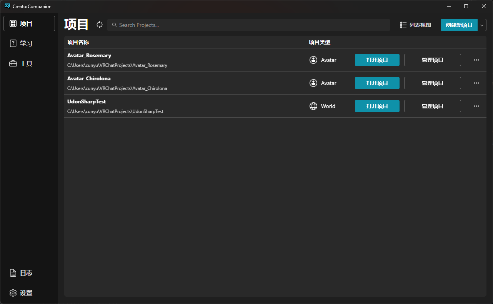
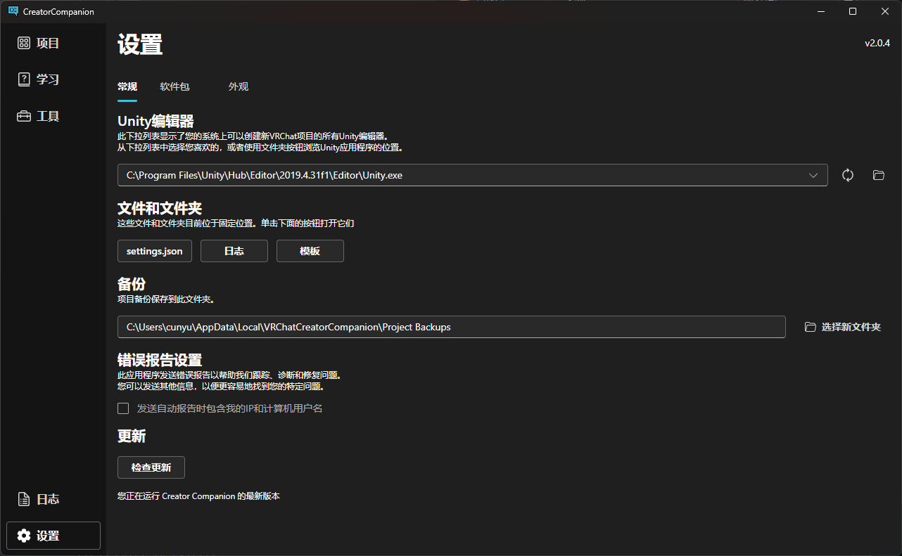

# VCC Auto Translate

VCC(VRChat Creator Companion) 的翻译脚本, 用于自动翻译 VCC 的界面.

当前支持的语言:

- [简体中文](./localization/zh-CN.json)
- [繁体中文](./localization/zh-TW.json)

## Screenshots

## 自动安装

你可以通过 [Release](https://github.com/gizmo-ds/vcc-auto-translate/releases/latest) 下载预编译的安装工具并运行,
该工具会自动安装翻译脚本.

> 如果出现错误, 请尝试将安装工具移动到 VCC 安装目录下运行. (与`CreatorCompanion.exe`同目录)

## 手动编译并安装

1. 安装 [Node.js](https://nodejs.org/en/download/)
2. 编译脚本 `npx esbuild src/index.ts --bundle --format=iife --platform=browser --outfile=vcc-auto-translate.js`
3. 将 `vcc-auto-translate.js` 复制到 VCC 的安装目录下的 `WebApp\Dist` 文件夹中
4. 将 `localization` 文件夹复制到 VCC 的安装目录下的 `WebApp\Dist` 文件夹中
5. 在 VCC 安装目录下的 `WebApp\Dist\index.html` 文件的 `<head>`
   标签中添加 ``

## 类似的项目

- [VRChat-Creator-Companion-zh-CN](https://github.com/Sonic853/VRChat-Creator-Companion-zh-CN)

## Sponsors

## Thanks

Thanks to [JetBrains](https://jb.gg/OpenSourceSupport) for the open source license(s).

## License

Code is distributed under [MIT](./LICENSE) license, feel free to use it in your proprietary projects as well.
